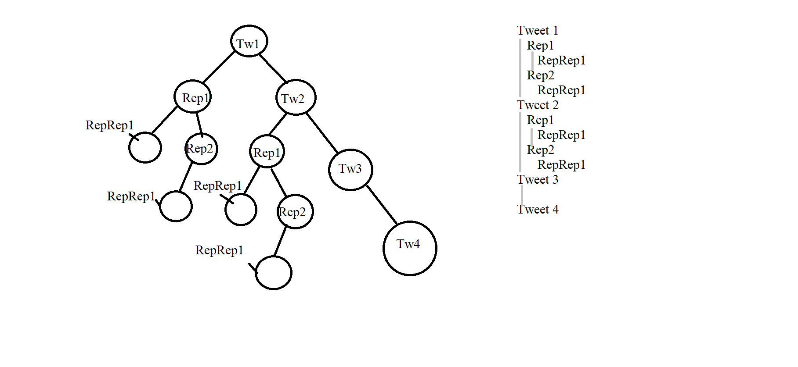

# Twitter-Algorithm-Using-C
Deploying a blog system using binary trees using C language. Each tweet acts as a node applying the basic binary tree rules.

## Working
1) Each original tweet acts as node.
2) Every new tweet gets added as the right child of the base node.
3) Any reply to a particular tweet (say, X) becomes the left child of X.

